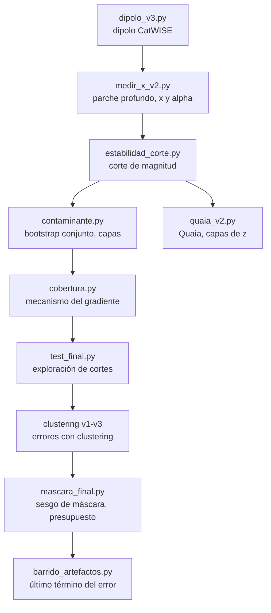

# Medición del dipolo cósmico en CatWISE2020 y Quaia: estudio de replicación independiente

*Documento de trabajo · 19 de septiembre de 2026*

## Resumen

Se midió el dipolo en la distribución angular de cuásares en dos catálogos con instrumentación y selección independientes, con un pipeline propio: estimador consciente de máscara, medición propia de los parámetros de la expectativa cinemática, validación por tests de estabilidad, y presupuesto de error con tres de sus cuatro términos medidos por simulación.

**Resultado principal, CatWISE2020.** Muestra W1−W2 ≥ 0.80, W1 < 16.00, |b| > 30°, sin Nubes de Magallanes, con rechazo de celdas atípicas por referencia local. N = 763 543.

| Cantidad | Valor |
| --- | --- |
| Amplitud del dipolo | 0.01592 ± 0.00250 |
| Dirección (l, b) | (258.2, +42.8) |
| Separación del dipolo CMB | 6.8° |
| Cociente sobre la expectativa cinemática | 2.38 ± 0.37 |
| Significancia frente a la nula cinemática | 3.47σ (componente paralela) |

Presupuesto de error sobre la amplitud: estadístico 15.5%, máscara 2.0%, expectativa cinemática 1.0%, rechazo de artefactos 0.9%. **Los cuatro términos están medidos** con simulaciones o barridos de parámetros; ninguno es una estimación.

**Resultado secundario, Quaia.** Con |b| > 40° y la función de selección publicada: 0.01121 ± 0.00308 a 2.4° del dipolo CMB en G20.0, y 0.01270 ± 0.00199 en G20.5. Ambos convergen al valor publicado de \~0.011.

**Resultado negativo.** No se detecta evolución del dipolo con el corrimiento al rojo. Con máscara estricta los dos catálogos de Quaia dan diferencias entre capas de z de signo opuesto, +1.0σ y −0.6σ, ninguna significativa. La aparente evolución con máscaras permisivas, de hasta 4.4σ, desaparece al retirar el plano galáctico.

### Qué es replicación y qué es propio

- **Replicación.** Amplitudes, direcciones y exceso sobre la expectativa cinemática reproducen resultados publicados en ambos catálogos. No son evidencia nueva para el campo.
- **Redescubrimiento independiente.** Los dos mecanismos de sistemática caracterizados aquí ya estaban descritos en la literatura. Se llegó a ellos sin conocerla, partiendo de los datos crudos.
- **Propio.** El pipeline completo, la metodología de validación, y la determinación cuantitativa de hasta dónde puede profundizarse la muestra sin contaminación medible.

El valor de este documento es el método, no el hallazgo: registra qué se midió, cómo, y por qué cada corte está donde está.

## Marco teórico

El movimiento del observador respecto al marco de reposo de las fuentes produce un dipolo en sus conteos angulares por dos efectos combinados: aberración, que desplaza posiciones hacia la dirección del movimiento, y boost Doppler, que altera flujos y empuja fuentes a través del umbral de detección. Ellis y Baldwin (1984) dan la amplitud resultante:

```latex
D = \left[\, 2 + x\,(1+\alpha) \,\right] \frac{v}{c}
```

con v/c = 369.82 / 299792.458 = 1.2336 × 10⁻³ para la velocidad inferida del dipolo del CMB. El término 2 es la aberración; el resto es el boost.

### La pendiente de conteos x

x se define por los conteos integrales en flujo, N(>S) ∝ S⁻ˣ. Como el flujo se relaciona con la magnitud por S ∝ 10^(−0.4m), los conteos en magnitud quedan:

```latex
\log_{10} N(<m) = 0.4\,x\,m + \text{cte}
\qquad\Longrightarrow\qquad
x = \frac{1}{0.4}\,\frac{d \log_{10} N(<m)}{dm}
```

Dos requisitos que en la práctica se incumplen con facilidad:

1. **La derivada es local, en el umbral.** El boost actúa empujando fuentes a través del corte, así que importa la pendiente exactamente ahí, no un promedio sobre un rango. Si los conteos son curvos, ambos números difieren.
2. **La muestra debe extenderse más allá del corte.** Medir la pendiente en m₀ usando un catálogo truncado en m₀ es imposible: la incompletitud del survey y el corte del catálogo se confunden. Aquí se resolvió descargando material más profundo — un parche de 1034 deg² hasta W1 < 18.0 para CatWISE, y el catálogo G20.5 para Quaia.

### El índice espectral α

α se define por Sᵥ ∝ ν^(−α) en la banda de observación. Se midió del color de la propia muestra en lugar de asumirlo. Para dos bandas con puntos cero de flujo F₀ y longitudes de onda efectivas λ:

```latex
\frac{S_1}{S_2} = \frac{F_{0,1}}{F_{0,2}}\,10^{-(m_1-m_2)/2.5}
= \left(\frac{\nu_1}{\nu_2}\right)^{-\alpha}
\qquad\Longrightarrow\qquad
\alpha = -\frac{\ln\!\left(S_1/S_2\right)}{\ln\!\left(\lambda_2/\lambda_1\right)}
```

Para WISE se usaron F₀ = 309.540 y 171.787 Jy con λ = 3.3526 y 4.6028 μm. Para Gaia, F₀ = 3552.01 y 2554.95 Jy con λ = 5109.7 y 7769.0 Å sobre el color BP−RP.

Como D es **lineal** en α, el valor correcto es una media, no una mediana. La sensibilidad es alta: en CatWISE, W1−W2 = 0.8 da α ≈ 0.47 mientras que 1.2 da α ≈ 1.63.

**Y el promedio debe tomarse en el umbral, no sobre la población.** El boost solo mueve fuentes que están *en* el corte: el número que lo cruza es proporcional a la densidad de fuentes ahí por el desplazamiento medio de magnitud, y ese desplazamiento depende del α de esas fuentes concretas. Como el color varía con la magnitud, los dos promedios difieren. En esta muestra, α vale 1.294 en una rodaja de ±0.10 mag alrededor de W1 = 16.00 y 1.341 promediado sobre todas las fuentes más brillantes que el corte. Usar el segundo infla la expectativa cinemática un 1.3%, más que el error del propio término.

### Sensibilidad de la expectativa

El cociente D\_obs/D\_esp depende fuertemente de ambos parámetros. Para el valor medido en CatWISE de D\_obs = 0.0169, con α = 1.0:

| x | D esperado | Exceso |
| --- | --- | --- |
| 1.2 | 0.0054 | 3.1× |
| 1.6 | 0.0064 | 2.6× |
| 2.0 | 0.0074 | 2.3× |

Esa dependencia es mayor que la incertidumbre estadística de la medición del dipolo, lo que hace de x y α la parte más delicada del cálculo.

## Método

### Estimador lineal consciente de máscara

Un ajuste de mínimos cuadrados de monopolo más dipolo sobre píxeles de cielo cortado está sesgado: en un cielo parcial monopolo y dipolo dejan de ser ortogonales, y la potencia de multipolos altos (clustering, sistemáticas) se filtra al dipolo. El estimador usado evita eso definiendo la máscara con un catálogo aleatorio.

Bajo el modelo dN/dΩ ∝ (1 + **D**·**n̂**) sobre la región no enmascarada, a primer orden en D:

```latex
\langle \hat{n} \rangle_{\text{datos}}
= \langle \hat{n} \rangle_{\text{mask}} + \mathbf{M}\,\mathbf{D},
\qquad
\mathbf{M} = \langle \hat{n}\hat{n}^{\mathsf{T}} \rangle_{\text{mask}}
- \langle \hat{n} \rangle_{\text{mask}} \langle \hat{n} \rangle_{\text{mask}}^{\mathsf{T}}
```

de donde

```latex
\mathbf{D} = \mathbf{M}^{-1}\left(\langle \hat{n} \rangle_{\text{datos}} - \langle \hat{n} \rangle_{\text{mask}}\right)
```

Los promedios sobre la máscara se calculan sobre una representación de la región no enmascarada, lo que maneja automáticamente cortes parciales y bordes. **M** se evalúa como uᵀu/N en lugar de por difusión 3D, para no agotar memoria con varios millones de puntos.

**Cómo se representa la región importa, y mucho.** Se probaron dos formas:

- **Catálogo aleatorio.** Millones de puntos distribuidos uniformemente sobre la esfera, filtrados por los mismos cortes geométricos. Intuitivo, pero introduce ruido de muestreo en ⟨n̂⟩\_mask que se amplifica al multiplicar por M⁻¹.
- **Rejilla determinista.** Los centros de píxel HEALPix a NSIDE = 512 que caen en la región. Sin ruido de muestreo.

La diferencia no es cosmética. Para dos casquetes |b| > 30° los autovalores de **M** son 0.21, 0.21 y 0.58, y la norma de **M⁻¹** es 4.8. Con 6 millones de puntos aleatorios, de los que unos 2.95 millones sobreviven a la máscara, el error de muestreo en ⟨n̂⟩\_mask es 3.3×10⁻⁴ por componente, que propagado da:

```latex
\sigma_{\text{MC}}(\mathbf{D}) \approx \lVert \mathbf{M}^{-1} \rVert \cdot \frac{\sigma(\hat{n})}{\sqrt{N_r}} \approx 1.1\times10^{-3}
```

Eso es el **7% de la señal medida**, y no aparece en ninguna barra de error calculada de la forma habitual. Bajarlo por debajo del 1% exigiría unos 50 millones de puntos aleatorios. La rejilla determinista lo elimina sin coste.

Todas las cifras de este documento con el catálogo aleatorio como referencia de máscara arrastran ese ±0.0011. Las comparaciones **relativas** dentro de una misma corrida están mucho menos afectadas, porque el ruido es común a todos los cortes; las amplitudes **absolutas** sí lo llevan. Los resultados finales usan la rejilla determinista.

Cuando la máscara es una función de selección continua w(**n̂**) en vez de binaria — el caso de Quaia — los promedios se ponderan por w. Para Quaia se usaron directamente los centros de píxel HEALPix del mapa publicado con peso igual a la probabilidad de detección, lo que es exacto y no introduce ruido de muestreo.

### Errores

El error de la amplitud es analítico, exacto para este estimador lineal:

```latex
\mathrm{Cov}(\mathbf{D}) = \mathbf{M}^{-1}\,\mathrm{Cov}\!\left(\langle \hat{n} \rangle_{\text{datos}}\right)\mathbf{M}^{-\mathsf{T}},
\qquad
\sigma_{|D|} = \sqrt{\hat{n}^{\mathsf{T}} \mathrm{Cov}(\mathbf{D})\, \hat{n}}
```

Ese error cubre únicamente el muestreo de las fuentes. **No incluye el clustering de cuásares**, que añade varianza porque las fuentes no caen de forma independiente sino que trazan la estructura a gran escala. Para incorporarlo se recurre a catálogos simulados:

1. Se mide el espectro de potencias angular C\_ℓ del mapa, corregido por f\_sky y con el ruido de disparo restado.
2. Se generan realizaciones gaussianas con ese C\_ℓ, con ℓ = 0 y ℓ = 1 anulados.
3. Se les inyecta el dipolo cinemático esperado y se muestrean con Poisson.
4. Se pasan por la misma máscara y el mismo estimador.

La dispersión de las amplitudes recuperadas es la barra de error real, y la fracción de simulaciones que igualan o superan el valor observado es el p-valor frente a la hipótesis de que el dipolo es puramente cinemático.

El C\_ℓ medido incluye toda la potencia del mapa, clustering real más sistemáticas residuales. Eso hace la barra **conservadora** de forma deliberada: ninguna estructura observada queda fuera del modelo de ruido, así que la significancia resultante es un límite inferior.

Medido así, el clustering infla el error un factor **1.50×** respecto a Poisson puro. Cualquier significancia calculada sin él está sobreestimada en esa proporción.

Para cortes anidados (mismo catálogo, distintos límites de magnitud) las mediciones están fuertemente correlacionadas y un χ² ingenuo carece de sentido. Se usó bootstrap conjunto: se remuestrea el catálogo padre una vez y se derivan todos los cortes de ese mismo remuestreo, lo que da la matriz de covarianza real. La implementación asigna a cada fuente un índice de capa y obtiene los cortes por suma acumulada, reduciendo cada iteración a tres `bincount` de longitud igual al número de cortes.

### Rechazo de artefactos

Los ajustes de dipolo son lineales en las cuentas, así que un puñado de píxeles anómalos puede dominar el resultado. Un umbral sobre la **media global** del mapa es la opción obvia y es incorrecta: la densidad de fondo varía un factor 2.2 sobre la máscara, con la latitud galáctica y con la cobertura, así que una referencia global marca como artefacto cualquier región legítimamente densa. Aplicado a este catálogo rechazaba 1324 píxeles, el 5.5% de la máscara, en un patrón espacialmente correlacionado que reinyectaba estructura en el mapa.

El criterio adoptado usa una **referencia local**: se suaviza el mapa de conteos con un haz de unos grados y cada píxel se compara con su propio entorno,

```latex
\text{exceso}_i = \frac{c_i - \langle c \rangle_i^{\text{suave}}}{\sqrt{\langle c \rangle_i^{\text{suave}}}}
```

así un artefacto real —una concentración puntual muy por encima de su vecindad— se marca, mientras que una región densa por gradiente o por clustering sube junto con su entorno y sobrevive. Con K = 8σ local y un haz de 5° se rechazan 88 píxeles.

Un barrido sobre K entre 6 y 25 y sobre la escala del entorno entre 3° y 12°, incluyendo el criterio global y el caso sin rechazo alguno, deja la amplitud entre 0.01539 y 0.01598: una dispersión del **0.9%**. El rechazo apenas mueve el módulo del dipolo. Lo que sí corrige es la **dirección**, de 26.7° del CMB sin rechazo a 6.2° con él.

### Tests de validación

Tres, aplicados sistemáticamente:

1. **Estabilidad frente a la máscara.** Una cantidad física no depende del corte galáctico; solo su barra de error debe crecer. Una amplitud que cae al ampliar la máscara indica contaminación galáctica residual.
2. **Estabilidad frente al corte de magnitud.** Se recalculan de forma consistente D\_obs y D\_esp en cada corte. Un cociente plano indica robustez frente a la selección.
3. **Capas disjuntas.** Muestras separadas por intervalos de magnitud o de redshift son estadísticamente independientes, lo que permite aislar contaminantes sin la dilución que introduce la señal de fondo.

## Datos

### CatWISE2020

Descargado por TAP desde IRSA/IPAC ([irsa.ipac.caltech.edu/TAP](https://irsa.ipac.caltech.edu/TAP)), tabla `catwise_2020`. Selección de AGN por el criterio de color W1−W2 ≥ 0.8, que distingue el espectro de ley de potencias de los AGN del cuerpo negro de estrellas y galaxias.

| Descarga | Cortes | N |
| --- | --- | --- |
| Cielo completo | W1−W2 ≥ 0.8, snr ≥ 5, W1 < 16.5 | 3 931 061 |
| Cielo completo con magnitudes | ídem, W1 < 17.0 | 8 868 819 |
| Parche profundo (RA 150–210, Dec 20–40, 1034 deg²) | ídem, W1 < 18.0 | 1 687 922 |
| Muestra de cobertura | ídem, W1 < 15.0, con `w1cov` | 899 535 |

El parche profundo existe únicamente para medir x en W1 = 16.5 sin que el corte del catálogo trunque los conteos. La muestra de cobertura mapea la profundidad del survey, que es propiedad del cielo y no requiere ir profundo.

### Quaia

Catálogo Gaia–unWISE, descargado de Zenodo (10.5281/zenodo.10403370) junto con su función de selección en formato HEALPix NSIDE = 64. Columnas usadas: `ra`, `dec`, `redshift_quaia`, `phot_g_mean_mag`, `phot_bp_mean_mag`, `phot_rp_mean_mag`.

| Versión | N | Uso |
| --- | --- | --- |
| G20.0 | 755 850 | Muestra principal |
| G20.5 | 1 295 502 | Medición de x, y comprobación independiente |

El mapa de selección resultó estar en coordenadas ecuatoriales. Se determinó automáticamente comparando el contraste polo/plano galáctico bajo ambas hipótesis: 0.85 interpretándolo como galáctico contra 14.21 como ecuatorial. La supresión del plano galáctico por polvo y densidad estelar es la firma física esperada.

### Máscaras aplicadas

- **Plano galáctico.** |b| > 30° en CatWISE; |b| > 40° en Quaia, donde el enrojecimiento galáctico es la sistemática dominante por trabajar en óptico.
- **Nubes de Magallanes.** Discos de 8° alrededor de LMC y SMC. La LMC está en b = −32.9° y sobrevive un corte de |b| > 30°, produciendo un exceso local del 54% en su banda de latitud eclíptica.
- **Celdas atípicas.** Rechazo por referencia local, como se describe en el método.

## Sistemáticas en CatWISE

Se identificaron dos contaminantes distintos, con mecanismos, firmas y remedios diferentes. Confundirlos fue el error que más tiempo costó corregir.

### Contaminante 1: dispersión fotométrica a través del corte de color

**Firma.** Un gradiente en latitud eclíptica, **simétrico** respecto al plano. Una estructura simétrica en |β| no puede provenir de un dipolo; es cuadrupolar y está alineada con el plano orbital de la Tierra, así que ninguna física cosmológica la produce.

**Mecanismo.** La cobertura de WISE es baja cerca del plano eclíptico y alta cerca de los polos. Menor cobertura implica mayores errores fotométricos, y como la mayoría de las fuentes del cielo son más azules que W1−W2 = 0.8, la dispersión hace que más fuentes crucen el umbral por ruido. Es sesgo de Eddington sobre el color.

**Cuatro comprobaciones independientes.**

| Test | Resultado |
| --- | --- |
| Dependencia con el color | Exceso en el plano de +12.8% (0.80–0.90), +8.3%, +2.4%, +0.7% (1.20–1.60): decae monótonamente a cero al alejarse del umbral |
| Dependencia con la magnitud | Ausente en W1 < 15.5 (0.968–0.993); aparece solo cerca del límite de detección |
| Rango de cobertura | 140.7 en \|β\| < 20° frente a 847.7 en \|β\| > 80°, un factor 6 |
| Test diferencial | Las fuentes débiles (W1 16.0–17.0) varían 13.8% con la cobertura; las brillantes (W1 < 15.5), 1.6% |

**El signo es la clave.** La densidad de fuentes débiles **decrece** al aumentar la cobertura. Si el efecto fuera simple profundidad de detección, más cobertura daría más fuentes. Da menos, lo cual solo se explica por dispersión cruzando el umbral de color.

**Cuánta potencia tiene realmente.** Una primera medición del espectro angular situó el cuadrupolo en 11.7 veces el ruido de disparo, lo que sugería una sistemática eclíptica enorme. Ese número era falso: procedía de un anillo de déficit artificial en el borde de la máscara, creado al filtrar las fuentes por su propia latitud galáctica mientras la máscara se evaluaba en los centros de píxel. Corregido, C₂ queda en **1.3–1.4 veces el ruido de disparo**. La sistemática eclíptica es real y su mecanismo está identificado, pero su contribución a la potencia de multipolos bajos es modesta.

### Contaminante 2: fragmentación de galaxias cercanas

**Firma.** Un dipolo genuino, agrumado espacialmente, concentrado en la cola roja del color. Su dirección, aislada mediante capas de magnitud disjuntas, es (l, b) = (232.9, +13.1) en coordenadas galácticas, equivalente a (RA, Dec) = (123.9, −11.1).

**Mecanismo.** El algoritmo `crowdsource` de detección de CatWISE está diseñado para fuentes puntuales. Las galaxias cercanas resueltas a la resolución de WISE se fragmentan en múltiples detecciones espurias, que son rojas y están agrupadas.

**Evidencia.**

| Test | Resultado |
| --- | --- |
| Color en celdas rechazadas | Mediana 1.171 dentro frente a 0.983 fuera; 47.8% con W1−W2 > 1.2 frente a 19.8% |
| Dipolo del tramo W1−W2 > 1.6 | 38.8% sin rechazo de celdas, 5.6% con rechazo |
| Descomposición por color | La suma vectorial de los tramos reproduce la dirección del contaminante a 9.6° |

**Punto importante: el gradiente eclíptico es ciego a este contaminante.** El tramo W1−W2 ∈ \[1.20, 1.60) tiene un gradiente de 1.002, perfectamente limpio según esa métrica, pero una componente perpendicular al CMB de 0.0263. Una métrica de contaminación no basta; hacen falta las dos.

## Resultados: CatWISE2020

### Progresión de la limpieza

Cada fila corrige un defecto identificado, con la muestra W1 < 16.5, |b| > 30°:

| Etapa | Amplitud | Separación del CMB |
| --- | --- | --- |
| Mínimos cuadrados sobre cielo cortado, marco de coordenadas confundido | 2.71% | (resultado no interpretable) |
| Estimador consciente de máscara, sin Nubes de Magallanes | 2.50% ± 0.16 | 42.5° |
| Con rechazo de celdas a 12σ | 1.69% ± 0.13 | 27.9° |

El estimador consciente de máscara y el rechazo de artefactos, juntos, reducen la amplitud casi a la mitad y mejoran la dirección en 15°.

### Estabilidad frente a la máscara

Sin rechazo de celdas la amplitud cae monótonamente al ampliar el corte galáctico (2.50 → 2.43 → 1.71 → 1.41% para |b| > 30, 40, 50, 60°), la firma de contaminación galáctica residual. Con rechazo a 12σ se estabiliza en 1.69 / 1.26 / 1.32 / 1.57%, plana dentro de las barras. El test pasa.

### Estabilidad frente al corte de magnitud

Con bootstrap conjunto sobre cinco cortes anidados, y por tanto correlacionados:

| Corte | N | x | D esperado | D observado | Cociente |
| --- | --- | --- | --- | --- | --- |
| W1 < 15.75 | 544 893 | 1.486 | 0.00673 | 0.01381 | 2.05 |
| W1 < 16.00 | 764 972 | 1.492 | 0.00673 | 0.01404 | 2.08 |
| W1 < 16.25 | 1 088 035 | 1.618 | 0.00705 | 0.01501 | 2.13 |
| W1 < 16.50 | 1 617 431 | 1.862 | 0.00760 | 0.01505 | 1.98 |
| W1 < 16.75 | 2 578 561 | 2.162 | 0.00820 | 0.01808 | 2.20 |

Cociente medio ponderado por covarianza: **2.18**, con χ²/gl = **0.96**. El cociente es plano pese a que x se mueve un 46% y D\_obs un 34% en el rango, lo cual es el contenido no trivial del test. El χ² ingenuo sin covarianza daba 0.22, un valor artificialmente bajo por el anidamiento y no interpretable.

### Descomposición señal más contaminante

Proyectando cada dipolo sobre la dirección del CMB:

| Corte | Componente paralela | Componente perpendicular | Separación |
| --- | --- | --- | --- |
| W1 < 15.75 | 0.01334 | 0.00356 | 15.0° |
| W1 < 16.00 | 0.01402 | 0.00062 | 2.5° |
| W1 < 16.25 | 0.01413 | 0.00506 | 19.7° |
| W1 < 16.50 | 0.01347 | 0.00671 | 26.5° |
| W1 < 16.75 | 0.01377 | 0.01172 | 40.4° |

La componente alineada con el CMB es constante en 0.01365 con 3% de dispersión, mientras la muestra crece cinco veces. La perpendicular crece un factor 7 hacia el extremo débil. Es señal estable más contaminante creciente.

### Muestra final

Se exploraron 32 configuraciones de corte en color y magnitud. **La selección se hizo por el gradiente eclíptico, una métrica de contaminación independiente del dipolo**, no por el dipolo resultante; elegir por el dipolo entre 32 opciones garantiza encontrar el valor deseado.

Ese criterio resultó insuficiente, por la razón explicada en Sistemáticas: el gradiente eclíptico no detecta el contaminante de fragmentos. La configuración que eligió tiene una componente perpendicular de 4.6σ. Ordenando por limpieza real:

| Color | W1 < | N | Separación | Perpendicular | Cociente |
| --- | --- | --- | --- | --- | --- |
| \[0.80, 1.60) | 16.00 | 751 725 | 1.4° | 0.2σ | 2.07 ± 0.30 |
| ≥ 0.80 | 16.00 | 763 912 | 2.5° | 0.3σ | 2.09 ± 0.30 |
| \[0.80, 1.60) | 16.25 | 1 069 453 | 18.2° | 2.5σ | 2.11 ± 0.27 |
| \[0.80, 1.60) | 16.50 | 1 591 192 | 25.2° | 3.9σ | 1.93 ± 0.21 |

**No existe una ventana que compre profundidad sin contaminación.** Pasar de W1 < 16.00 a 16.25 aporta 42% más fuentes pero reduce el error del cociente solo un 10%, e introduce un contaminante de 2.5σ. El corte superior en color a 1.60 mejora la dirección de 2.5° a 1.4° perdiendo 12 000 fuentes, una ganancia marginal pero consistente con el mecanismo.

Las amplitudes de esta sección proceden de la fase con catálogo aleatorio y arrastran el ±0.0011 de ruido de muestreo descrito en Método. Las comparaciones entre configuraciones siguen siendo válidas, porque ese ruido es común a todas; los valores absolutos hay que tomarlos del apartado siguiente.

### Medición final y presupuesto de error

Con la región de la máscara representada por rejilla determinista (sin ruido de muestreo), rechazo de artefactos por referencia local, y simulaciones con clustering para los errores. Sin corte superior de color, por las razones del apartado siguiente:

| Cantidad | Valor |
| --- | --- |
| Amplitud del dipolo | 0.01592 |
| Dirección (l, b) | (258.2, +42.8) |
| Separación del dipolo CMB | 6.8° |
| Componente paralela al CMB | 0.01581 |
| Componente perpendicular | 0.00188 |
| Expectativa cinemática | 0.00670 |
| Cociente | 2.38 |

Presupuesto de error sobre la amplitud:

| Término | Valor | % | Cómo se obtuvo |
| --- | --- | --- | --- |
| Estadístico | ± 0.00247 | 15.5% | 2000 simulaciones con clustering + Poisson |
| Máscara | ± 0.00032 | 2.0% | Diferencia entre región continua y escalera |
| Expectativa cinemática | ± 0.00016 | 1.0% | x con barrido de ventana, α en el umbral |
| Rechazo de artefactos | ± 0.00015 | 0.9% | Barrido de K y de la escala del entorno |
| **Total en cuadratura** | **± 0.00250** | **15.7%** |  |

La expectativa cinemática se midió con x = 1.4909 ± 0.0236 (barrido de la ventana del ajuste, que separa el error estadístico del sistemático que introduce la falta de meseta) y α = 1.2940 ± 0.0060 promediado en una rodaja de ±0.10 mag alrededor del corte. Resulta D_esp = 0.00669 ± 0.00007, un **1.0%**. Una versión previa de este documento la estimaba en un 10% a ojo; el valor central era correcto dentro del 0.2%, pero la barra era diez veces demasiado pesimista.

**Cociente = 2.38 ± 0.37.** Significancia frente a la nula cinemática, con 2000 simulaciones: **3.12σ** sobre la amplitud y **3.47σ** sobre la componente paralela, que es la cantidad físicamente limpia porque excluye el contaminante perpendicular conocido. La expectativa no entra en la significancia: la nula se construye inyectando el dipolo esperado en las simulaciones y comparando amplitudes.

### La cola roja del color

El tramo más rojo de la distribución de color está contaminado, y se caracterizó con un barrido del umbral superior entre 1.20 y sin corte. Las fuentes por encima de cada umbral tienen dipolos grandes y apartados de la dirección del CMB:

| Umbral | N eliminado | % | \|D\| de lo eliminado | Separación del CMB | Contribución al total |
| --- | --- | --- | --- | --- | --- |
| 1.20 | 222 399 | 29.1% | 0.0259 | 60.4° | 0.00755 |
| 1.40 | 58 777 | 7.7% | 0.0384 | 56.4° | 0.00296 |
| 1.60 | 12 149 | 1.6% | 0.0486 | 53.1° | 0.00077 |
| 1.80 | 3 507 | 0.5% | 0.1201 | 74.9° | 0.00055 |

Es una población real y sucia, consistente con la fragmentación de galaxias descrita en Sistemáticas. **Pero son demasiado pocas para importar:** cortando en 1.60 se retira una contribución de 0.00077, el 31% del error total.

El efecto sobre el resultado es nulo. Entre 1.40 y sin corte, la componente perpendicular es plana (0.00167 a 0.00200) con errores de ~0.0027; el mejor umbral está a **−0.34σ** de no cortar, medido con bootstrap conjunto que respeta el anidamiento de las muestras.

Y cortar de más perjudica: en 1.20 se elimina el 29% de la muestra, la amplitud sube a 0.01879, la dirección se va a 24.9° y el cociente a 2.97. Por debajo de 1.40 ya no se retira contaminación sino cuásares genuinos.

**Por eso no se aplica corte superior.** No existe un umbral que mejore el resultado de forma significativa, y adoptar uno introduciría una elección arbitraria sin respaldo en los datos. La cola roja queda caracterizada como un contaminante identificado cuya contribución está por debajo del suelo de ruido.

Dos validaciones del estimador, ambas superadas:

- **Insesgadez.** Inyectando dipolos de 0.007 y 0.014 y recuperándolos con las dos definiciones de máscara, el sesgo medio es +0.5% en ambas. El estimador no distorsiona la amplitud.
- **Discrepancia entre máscaras.** Que dos representaciones insesgadas difieran un 4% sobre datos reales indica acoplamiento de multipolos altos reales a través de bordes de geometría distinta. Es un sistemático legítimo, no un error, y por eso figura en el presupuesto.

## Resultados: Quaia

Quaia se eligió por tres razones: selección independiente (óptico de Gaia más infrarrojo de unWISE), función de selección publicada, y disponibilidad de corrimiento al rojo, lo que permite preguntar si el dipolo evoluciona con el tiempo cósmico.

### El control

La primera medición falló el control: con |b| > 15° y umbral de selección 0.50 dio un cociente de 4.88 y una dirección a 53° del CMB, frente a lo publicado de \~0.011 apuntando cerca del CMB. La causa fue una máscara demasiado permisiva: conservaba el 90.5% de las fuentes, cuando la literatura usa un corte estricto de |b| > 40°. En un catálogo óptico el enrojecimiento galáctico es la sistemática dominante.

Con el corte estricto:

| Catálogo | \|b\| > | N | Amplitud | Dirección (l, b) | Separación del CMB |
| --- | --- | --- | --- | --- | --- |
| G20.0 | 40° | 389 762 | 0.01121 ± 0.00308 | (260.4, +48.0) | **2.4°** |
| G20.0 | 50° | 265 568 | 0.01212 ± 0.00509 | (230.5, +33.5) | 29.0° |
| G20.5 | 40° | 671 889 | 0.01270 ± 0.00199 | (324.1, +61.9) | 35.5° |
| G20.5 | 50° | 456 309 | 0.01160 ± 0.00244 | (259.8, +65.4) | 17.3° |

La amplitud cae monótonamente al endurecer el corte (2.26 → 1.94 → 1.77 → 1.12% en G20.0) y converge al valor publicado. Dos catálogos con profundidades distintas aterrizan juntos.

### Dónde queda la discrepancia

La amplitud medida coincide con la publicada, pero el cociente no, y el desajuste está enteramente en el denominador:

| Cantidad | Medido aquí | Publicado |
| --- | --- | --- |
| Amplitud, G20.0 con \|b\| > 40° | 0.01121 ± 0.00308 | \~0.0110 |
| Expectativa cinemática | 0.00506 | \~0.0080 |
| Cociente | 2.22 | \~1.4 |

Dividiendo la amplitud medida entre la expectativa publicada se obtiene 1.40, el valor de la literatura. El factor \[2 + x(1+α)\] calculado aquí es 4.10 frente al 6.49 implícito en lo publicado.

**La causa es conocida:** Ellis-Baldwin asume un corte limpio de flujo, y Quaia no lo tiene. Su selección es la clasificación de cuásares de Gaia más un corte de magnitud, así que la pendiente de conteos en el límite no tiene el mismo significado. Los análisis publicados calculan los conteos boosteados numéricamente y muestrean α de una distribución, en lugar de usar la fórmula linealizada.

### Evolución con el redshift: resultado negativo

Diferencia entre la capa de z alto y la de z bajo, con bordes fijos en z = 1.50:

| Máscara | G20.0 | G20.5 |
| --- | --- | --- |
| \|b\| > 15° | −2.1σ | −2.8σ |
| \|b\| > 25° | −1.6σ | −4.4σ |
| \|b\| > 30° | −0.8σ | −3.2σ |
| \|b\| > 40° | **+1.0σ** | **−0.6σ** |
| \|b\| > 50° | +1.0σ | +1.0σ |

Con máscaras permisivas aparece una señal de hasta 4.4σ, pero **negativa**: z bajo mayor que z alto. Al retirar el plano galáctico se desploma a \~1σ y los dos catálogos apuntan en direcciones opuestas. Dado que G20.0 está contenido en G20.5, un desacuerdo de signo entre ellos indica ruido, no una medición débil.

**Conclusión: no hay evolución detectable con estos datos.** La aparente evolución era enrojecimiento galáctico, y su signo dependía de dónde se pusieran los bordes de las capas.

El límite no es del método sino del catálogo: con f\_sky = 0.35 y unas 200 000 fuentes por capa, las barras por bin son del 40–50%, insuficientes para resolver un efecto del 30% aunque existiera. Cerrar esta pregunta requiere redshifts espectroscópicos, más cielo, o un análisis conjunto.

## Comparación con la literatura

### Concordancia de las mediciones

| Cantidad | Este trabajo | Publicado |
| --- | --- | --- |
| Amplitud CatWISE | 0.01592 a 6.8° del CMB | 0.0155 a \~27° ([Secrest et al. 2021](https://iopscience.iop.org/article/10.3847/2041-8213/abdd40)) |
| Amplitud Quaia, \|b\| > 40° | 0.01121 ± 0.00308 | \~0.011 ([Dam et al. 2023](https://arxiv.org/pdf/2405.09762)) |
| Exceso sobre la expectativa | 2.38 ± 0.37 | \~2× |
| Significancia | 3.47σ | 4.9σ (Secrest); 3.27–3.63σ (reevaluación 2025) |

### Lo que ya estaba descrito

Los dos mecanismos de sistemática caracterizados aquí están publicados, y en el caso del sesgo de color con un enunciado casi idéntico. El [Colloquium sobre la anomalía del dipolo cósmico](https://arxiv.org/pdf/2505.23526) atribuye el sesgo de latitud eclíptica, siguiendo a Secrest et al. 2022, al deblending de fuentes en imágenes más profundas a latitudes eclípticas altas y a que AGN algo más azules se dispersan preferentemente dentro del corte de color W1−W2 en las imágenes más superficiales a latitudes eclípticas bajas.

Esos son exactamente los dos contaminantes descritos en este documento. El trabajo reciente [Wising up to CatWISE](https://academic.oup.com/mnras/advance-article-pdf/doi/10.1093/mnras/stag248/66817469/stag248.pdf) señala explícitamente el corte en color W12 como progenitor del sesgo eclíptico de CatWISE y construye una tabla de cuatro dimensiones de los errores fotométricos conjuntos de W1 y W2 en función de magnitud y cobertura en ambas bandas.

Secrest et al. 2021 además aplican un corte de magnitud W1 < 16.4 precisamente para excluir objetos débiles afectados por cobertura desigual, corrigen la extinción galáctica con el mapa de polvo de Planck, aplican una corrección lineal de densidad contra latitud eclíptica, y eliminan 57 objetos con `w1cov` anómalamente baja y colores W1−W2 altos.

El corte W1 < 16.00 adoptado aquí es más conservador que el suyo.

### El estado del debate

La anomalía está en disputa activa, y la discusión se centra precisamente en estas sistemáticas:

- Una [reevaluación reciente](https://arxiv.org/pdf/2511.00822) con simulaciones completas baja la significancia de 4.9σ a 3.27–3.63σ.
- Abghari et al. (2024) cuestionan la corrección eclíptica y atribuyen el gradiente a contaminación estelar, lo que el Colloquium rebate señalando que la eclíptica es el eje observacional de WISE y no puede deberse a estrellas.
- *Wising up to CatWISE* encuentra que los modelos favorecidos por la evidencia bayesiana son los que aumentan la escala de los errores fotométricos.
- Existe además un argumento independiente de que la fórmula de Ellis-Baldwin se está aplicando fuera de sus supuestos.

Este último punto se manifestó directamente en la medición: la pendiente local x(m) **no presenta meseta** en la muestra de CatWISE. Sube con una pendiente de \~0.7 unidades por magnitud cerca del corte, lo que significa que los conteos no siguen una ley de potencias en ese rango, que es justamente lo que la fórmula asume. La barra estadística de ±0.007 sobre x es diez veces menor que el efecto de desplazar el corte 0.1 magnitudes.

## Limitaciones

En orden de importancia para cualquier uso posterior de estos números.

**1. El C_ℓ se corrigió por f_sky de forma cruda.** Es la limitación de método más seria que queda. Un tratamiento riguroso de cielo cortado, con deconvolución de la matriz de acoplamiento, da un C_ℓ algo distinto a multipolos bajos, que es justo donde más pesa para el dipolo. Afecta al término estadístico, que es el 15.5% del error y domina el presupuesto, probablemente en un 5–10% de su valor. Además el campo generado en las simulaciones es gaussiano, y el campo de densidad real no lo es a escalas pequeñas, aunque a los multipolos que dominan el dipolo la aproximación es razonable.

**2. La pendiente de conteos x no tiene meseta, aunque su efecto es menor de lo temido.** Un barrido de la ventana del ajuste entre ±0.10 y ±0.50 mag da x entre 1.463 y 1.529, creciendo de forma monótona: los conteos no siguen una ley de potencias en ese rango, que es lo que la fórmula de Ellis-Baldwin asume. Pero la dispersión sobre ventanas razonables es del 1.4%, así que la consecuencia numérica es pequeña y está dentro del término de expectativa del presupuesto.

**3. Las cifras de la fase con catálogo aleatorio llevan ruido de muestreo no cuantificado.** Representar la región de la máscara con 6 millones de puntos aleatorios inyecta ±0.0011 en la amplitud, el 7% de la señal, y ese término no aparece en las barras calculadas entonces. Los resultados finales usan rejilla determinista y no lo tienen, pero las tablas de estabilidad y de exploración de cortes sí. Sus comparaciones relativas siguen siendo válidas; sus valores absolutos no deben citarse.

**4. Un contaminante sin identificar del todo.** El dipolo residual en (232.9, +13.1) tiene domicilio en la cola roja del color y una causa plausible en la fragmentación de galaxias, pero no se comparó contra un catálogo de galaxias cercanas para confirmarlo objeto por objeto.

**5. La búsqueda sobre 32 configuraciones es un riesgo metodológico.** Se mitigó eligiendo por una métrica independiente del dipolo, pero esa métrica resultó incompleta. Cualquier lector debe saber que las configuraciones se exploraron antes de fijar el criterio.

**6. La cola roja del color está contaminada y no se corrige.** Las fuentes con W1−W2 > 1.60 tienen un dipolo de 0.0486 apuntando a 53° del CMB, y las de W1−W2 > 1.80 llegan a 0.1201 a 75°. Son contaminación real, pero su contribución al dipolo total es 0.00077, el 31% del error, así que eliminarlas no cambia el resultado de forma medible (−0.34σ en el mejor umbral del barrido). No se aplica corte superior para no introducir una elección arbitraria sin respaldo en los datos. Quien quiera una muestra más pura a costa de estadística puede cortar en 1.60; el resultado se desplaza 0.10σ.

### Trabajo pendiente

Con este catálogo el presupuesto de error está cerrado: los cuatro términos están medidos. Lo que queda es opcional y no mueve ningún número del resultado.

1. **Estimación de C_ℓ con deconvolución de la matriz de acoplamiento** (MASTER), en lugar de la corrección cruda por f_sky. Es lo único que mejoraría el término dominante. Afectaría al 15.5% estadístico en un 5–10% de su valor, o sea alrededor de un 1% del error total.
2. **Cruce de la cola roja del color contra un catálogo de galaxias cercanas**, para confirmar el mecanismo de fragmentación por identificación directa objeto a objeto. Confirmaría la interpretación pero no cambiaría ninguna cifra: la contribución de esa población ya está acotada en 0.00077, por debajo del suelo de ruido.

Una versión previa de esta lista incluía "calcular el boost Doppler numéricamente en lugar de la fórmula linealizada". Estaba mal planteado: la linealización se hace en β = 0.0012336 y los términos de orden β² son de ~10⁻⁶, cinco órdenes de magnitud por debajo de la señal. Se verificó contando fuentes con el corte de magnitud desplazado por el boost exacto, factor de Lorentz incluido. La fórmula no necesita corrección; lo que estaba mal medido eran x y α.

## Reproducibilidad

### Orden de ejecución



### Scripts

| Script | Qué hace | Salida |
| --- | --- | --- |
| `dipolo_v3.py` | Dipolo CatWISE con estimador consciente de máscara, rechazo de artefactos, test de estabilidad de máscara | `cielo_cache.npz` |
| `medir_x_v2.py` | Descarga el parche profundo, mide x local y α del color | `catwise_parche_profundo.ecsv` |
| `estabilidad_corte.py` | D\_obs y D\_esp recalculados de forma consistente por corte de magnitud | `cielo_cache.npz` |
| `contaminante.py` | Bootstrap conjunto, matriz de covarianza, capas disjuntas, dirección del contaminante | — |
| `cobertura.py` | Test de color, test diferencial de cobertura, mapa de `w1cov` | `cobertura_cache.npz` |
| `test_final.py` | Rejilla de 32 configuraciones, selección por gradiente eclíptico | — |
| `quaia_v2.py` | Quaia con función de selección, capas de z, test de máscara | — |
| `clustering.py` / `_v2` / `_v3` | Errores con clustering por simulación. v1 tenía el anillo de borde; v2 lo corrige; v3 añade la referencia local | — |
| `reconciliar.py` | Aísla la discrepancia entre estimadores variando una cosa a la vez | — |
| `mascara_final.py` | Test de sesgo de las dos máscaras, significancia, presupuesto de error | — |
| `barrido_artefactos.py` | Barrido de K y de la escala del entorno; último término del presupuesto | — |
| `barrido_color.py` | Barrido del umbral superior de color con bootstrap conjunto; caracteriza la cola roja | — |
| `expectativa.py` | Verifica la linealización, mide x con barrido de ventana y α en el umbral; cierra el presupuesto | — |

### Archivos de datos

| Archivo | Origen | Tamaño |
| --- | --- | --- |
| `cielo_cache.npz` | IRSA TAP, CatWISE2020 | 8 868 819 fuentes |
| `catwise_parche_profundo.ecsv` | IRSA TAP, parche 1034 deg² | 1 687 922 fuentes |
| `cobertura_cache.npz` | IRSA TAP, con `w1cov` | 899 535 fuentes |
| `quaia_G20.0.fits` | Zenodo 10.5281/zenodo.10403370 | 755 850 fuentes |
| `quaia_G20.5.fits` | ídem | 1 295 502 fuentes |
| `selection_function_NSIDE64_G20.0.fits` | ídem | HEALPix NSIDE 64 |

### Notas de implementación

- Las transformaciones de coordenadas se implementaron a mano con numpy. El polo norte galáctico se toma en (RA, Dec) = (192.85948, 27.12825) con longitud galáctica del polo norte celeste 122.93192; la oblicuidad de la eclíptica en 23.4392911°.
- **Los tres errores más caros del proyecto fueron todos geométricos, no físicos.** Pixelizar en ecuatoriales y comparar contra una dirección expresada en galácticas (131.7° aparentes contra 43.2° reales). Filtrar las fuentes por su propia latitud mientras la máscara se evaluaba en centros de pível, lo que creó un anillo de déficit en el borde e infló C₂ por un factor 9. Y representar la región de la máscara con un catálogo aleatorio demasiado pequeño, que inyectaba un 7% de ruido en la amplitud.
- Cualquier mapa HEALPix externo debe verificarse: el de Quaia está en coordenadas ecuatoriales, no galácticas. La comprobación es medir el contraste polo/plano galáctico bajo ambas hipótesis y quedarse con la que muestra supresión del plano.
- Al variar la máscara entre corridas, los bordes de las capas de redshift deben ser **absolutos y fijos**, nunca cuantiles: con cuantiles los bordes se recalculan y las comparaciones dejan de ser entre las mismas poblaciones.
- Cuando dos métodos que deberían medir lo mismo difieren, el reflejo correcto es variar una cosa a la vez hasta aislar la causa, no redefinir el test para que coincidan. Un test que no puede fallar no valida nada.
